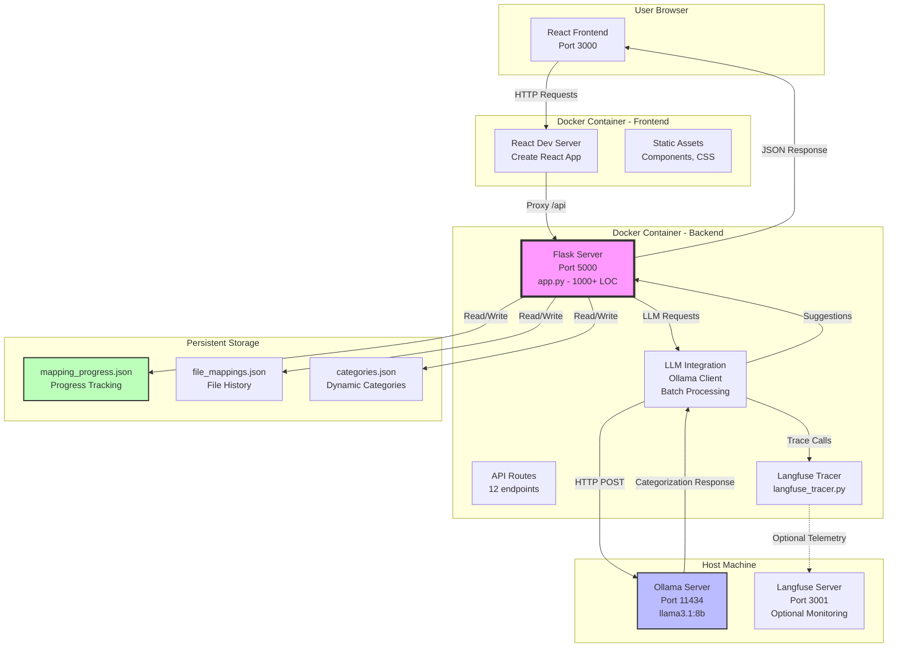
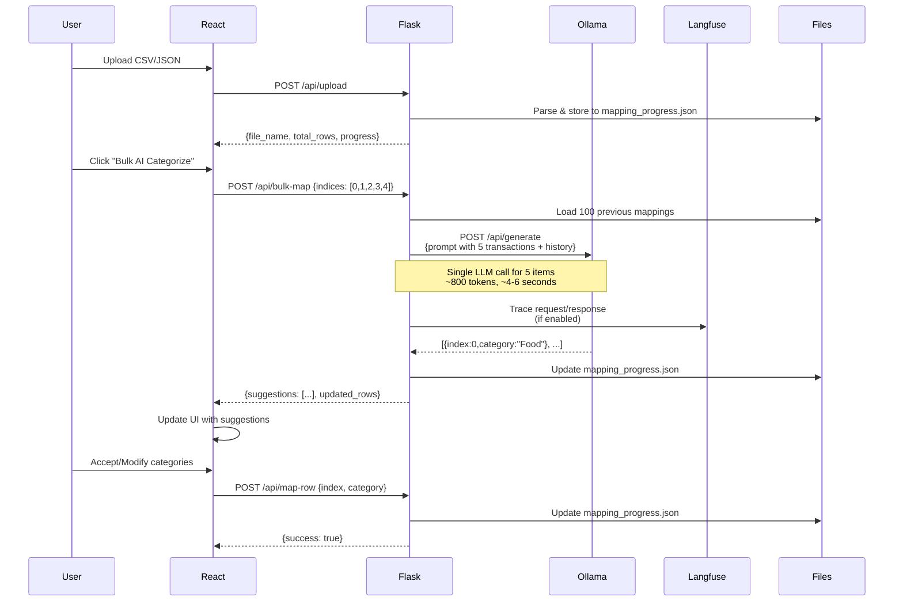
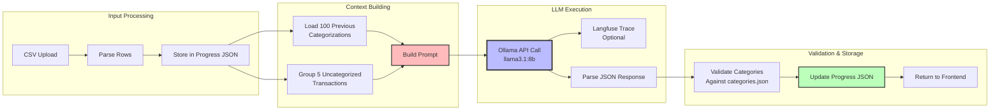
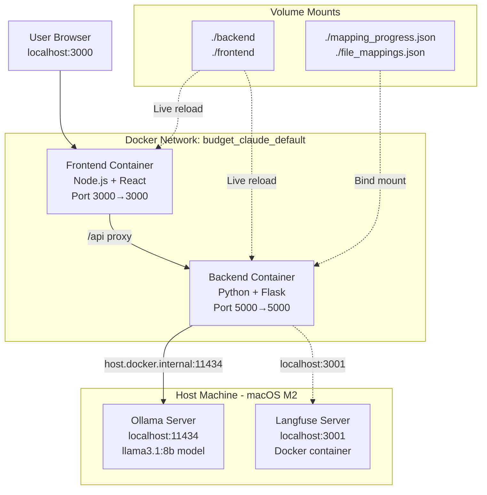
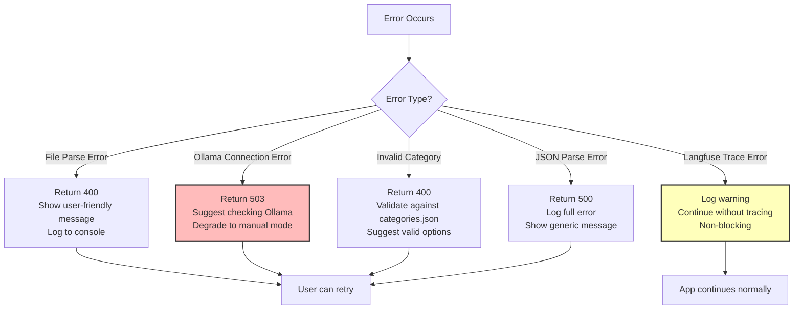

# Budget Claude - Architecture Documentation

## System Architecture Overview



## File Structure

```
budget_claude/
├── backend/
│   ├── app.py                      [1000+ LOC - Monolithic Flask app]
│   │   ├── CORS Configuration
│   │   ├── 12 API Endpoints
│   │   ├── LLM Integration Logic
│   │   ├── Batch Processing (5 items)
│   │   ├── Historical Context (100 examples)
│   │   └── File I/O Operations
│   ├── langfuse_tracer.py          [LLM tracing/monitoring]
│   ├── categories.json             [Dynamic category storage]
│   ├── .env                        [Ollama + Langfuse config]
│   └── Dockerfile
├── frontend/
│   ├── src/
│   │   ├── App.js                  [Main React component]
│   │   ├── components/
│   │   │   ├── FileUpload.js       [CSV/JSON upload]
│   │   │   ├── MappingInterface.js [Transaction UI with AI]
│   │   │   ├── ReviewScreen.js     [Review all mappings]
│   │   │   ├── Stats.js            [Real-time statistics]
│   │   │   └── Analytics.js        [Spending dashboard]
│   │   └── App.css
│   ├── package.json
│   └── Dockerfile
├── docker-compose.yml
├── pyproject.toml                  [Poetry dependencies]
├── mapping_progress.json           [Auto-generated, committed]
└── file_mappings.json              [Auto-generated, committed]
```

## API Endpoint Flow



## Data Flow - LLM Integration



## Key Design Decisions

### 1. Monolithic Backend (app.py)
**Rationale**: Rapid iteration and simplicity
- Single file contains all logic (1000+ LOC)
- Easier to understand data flow
- No import complexity
- Trade-off: Lower maintainability at scale

### 2. JSON File Persistence
**Rationale**: Simplicity over database
- `mapping_progress.json`: Current session state
- `file_mappings.json`: Historical file tracking
- `categories.json`: Dynamic category management
- Files committed to git for continuity across sessions
- Trade-off: No concurrent user support, limited scalability

### 3. Batch Processing (5 items)
**Rationale**: Balance between speed and quality
- Single transaction: ~2-3 seconds
- Batch of 5: ~4-6 seconds (5x speedup)
- Larger batches (10+) caused quality degradation
- Historical context (100 examples) improves accuracy

### 4. Ollama via Docker host.docker.internal
**Rationale**: Keep LLM on host for performance
- M2 Mac runs Ollama natively (better GPU access)
- Docker containers access via `host.docker.internal:11434`
- Trade-off: Platform-specific (macOS/Windows), not pure containerization

## Component Responsibilities

### Backend (app.py)
```python
# Key Functions:
upload()              # Parse CSV/JSON, initialize progress
get_progress()        # Return current mapping state
map_row()            # Manually assign category
suggest_category()    # Single transaction AI suggestion
bulk_map()           # Batch AI categorization (5 items)
reset_file()         # Clear progress for file
get_categories()     # Return available categories
add_category()       # Dynamic category creation
get_stats()          # Real-time mapping statistics
get_analytics()      # Spending insights dashboard
```

### Frontend (React Components)
```javascript
// Component Hierarchy:
App.js
├── FileUpload.js         // CSV/JSON drag-drop upload
├── MappingInterface.js   // Core categorization UI
│   ├── AI Suggest Button (single)
│   ├── Bulk AI Button (5 items)
│   ├── Category Dropdown
│   └── Progress Bar
├── Stats.js              // Category breakdown sidebar
├── ReviewScreen.js       // Pre-finalize review
└── Analytics.js          // Post-mapping insights
```

## Performance Characteristics

### Latency Breakdown
```
User Action → Response Time
├── Upload CSV (100 rows):        ~200ms
├── Single AI Suggestion:         ~2.1s
│   ├── Context loading:          50ms
│   ├── Ollama processing:        1.8s
│   ├── Response parsing:         30ms
│   └── Langfuse trace:           200ms (optional)
├── Bulk AI (5 items):            ~4.8s
│   ├── Context loading:          50ms
│   ├── Ollama processing:        4.3s
│   ├── Response parsing:         150ms
│   └── Langfuse trace:           300ms (optional)
└── Manual categorization:        ~100ms
```

### Token Usage (Ollama llama3.1:8b)
```
Operation              Input Tokens    Output Tokens
Single Suggestion:     ~300           ~50
Batch (5 items):       ~700           ~100
With 100 examples:     +2000          (same)

Cost: $0/month (local) vs $15-30/month (GPT-4)
```

## Docker Architecture



## Error Handling Strategy



### Error Handling Trade-offs
- **Inline exception handling** throughout app.py
- **No centralized error handler** (unlike FastAPI)
- **Graceful degradation** for Langfuse failures
- **User-friendly messages** in responses
- Trade-off: Error handling scattered, harder to maintain

## Comparison: Flask vs FastAPI (budget_cursor)

| Aspect | budget_claude (Flask) | budget_cursor (FastAPI) |
|--------|----------------------|-------------------------|
| **Structure** | Monolithic `app.py` | Modular `app/` package |
| **Type Safety** | Duck typing | Pydantic models |
| **Validation** | Manual in endpoints | Automatic via models |
| **Docs** | Manual README | Auto Swagger UI |
| **Error Handling** | Inline try/except | HTTPException + validators |
| **Testing** | None | pytest suite |
| **Async Support** | WSGI (sync) | ASGI (async capable) |
| **Dev Speed** | ⭐⭐⭐⭐⭐ Fastest | ⭐⭐⭐⭐ Fast |
| **Production Ready** | ⭐⭐⭐ Good | ⭐⭐⭐⭐⭐ Excellent |

## Future Considerations

### Scalability Limitations
1. **JSON file storage** doesn't support concurrent users
2. **Monolithic app.py** becomes harder to maintain beyond 1500+ LOC
3. **No database** limits query capabilities and reporting
4. **No user authentication** - single-user assumption

### Potential Improvements
1. Migrate to PostgreSQL/SQLite for multi-user support
2. Split app.py into modules (routes, services, models)
3. Add Redis caching for LLM responses
4. Implement user authentication (JWT tokens)
5. Add comprehensive error tracking (Sentry)
6. Create CI/CD pipeline with automated tests

### Why These Weren't Implemented
- **Scope**: MVP focused on core categorization feature
- **Speed**: Claude Code optimized for rapid prototyping
- **Use Case**: Single-user, local deployment scenario
- **Trade-off**: Accepted technical debt for faster time-to-demo
